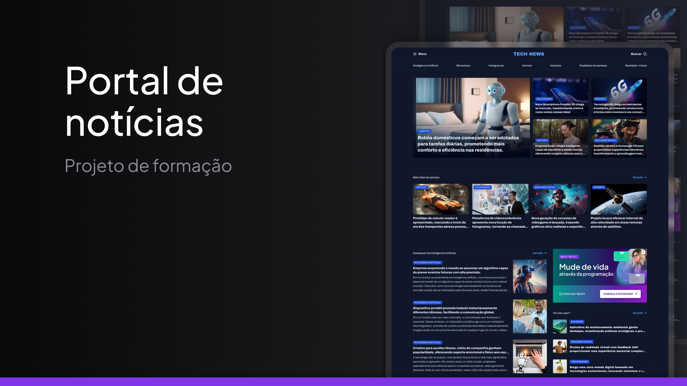

<h1 align="center"> Portal de notícias </h1>

Página de notícias com foco no meu aprendizado em Grids.

  

## 🚀 Tecnologias

Esse projeto foi desenvolvido com as seguintes tecnologias:

- HTML e CSS
- Git e Github
- Figma